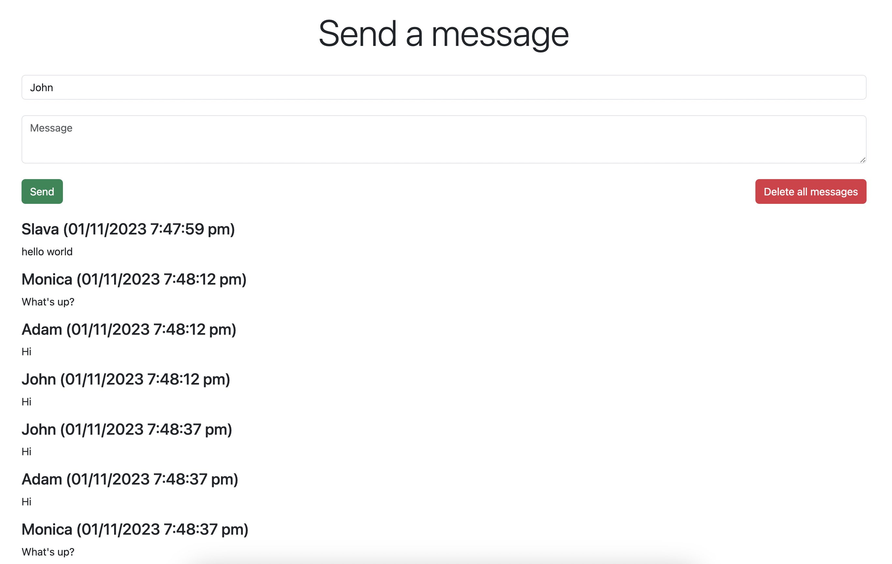

NodeJS, Express, Bootstrap, JQuery, Socket.io, Mongoose, MongoDB, Jasmine

`npm init --yes`

`npm i -s express`

`npm install -g nodemon`

`nodemon server.js`

`http://localhost:3000/`

`npm i -s body-parser`

`npm i -s socket.io`

set up account on mlab.com for free mongoDB

`npm i -s mongoose`

`npm install --save-dev jasmine`

`./node_modules/.bin/jasmine init (as it is not installed globally)`

`in package.json update "scripts": { "test": "jasmine"`

`npm install --save-dev request`

`npm install --save-dev moment`

`npm test`